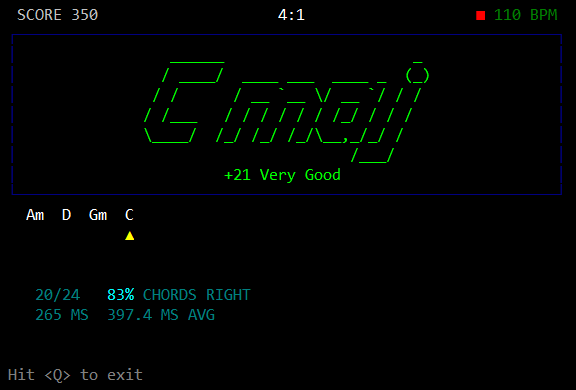

# chord_trainer

chord_trainer is an open source game to help with practicing guitar chords written in Python. It uses the [madmom](https://github.com/CPJKU/madmom) audio signal processing library to recognize chords and audio onset. It performs well enough that it's actually useful, amazingly. The chord recognizer only distinguishes between the 24 major and minor chords, which overlaps in recognizing 7th chords for example. So, playing a Gm7 is recognized as Gm. Which still works fine for practicing. The game runs a metronome over the chord chart at one chord per measure. When a chord is recognized over the audio-in device, the game scores the chord based on its delay from the first beat in the measure.



[Demo Video](chord_trainer_demo_1.mp4 "chord_trainer.py demo video")


# usage
```
usage: .\chord_trainer.py -i <device ID> -o <device ID> -b <bpm> -c <chords> -d -v <device> -h

-i <device ID>, --input   : use this device ID for input
-o <device ID>, --output  : use this device ID for output
-b <bpm>,       --bpm     : set tempo to <bpm>
-c <chords>,    --chords  : use comma separated list as chart (eg. "-c Am,D,Gm,C")
-d,             --devices : list all audio devices
-e <beats>,     --beats   : beats per chord
-v <device>,    --verbose : show device(s) with verbose info (eg. "-v Speaker" shows all
                            devices with "Speaker" in its name)
-h,             --help    : show usage information
```
  
  
# Acknowledgements
written by [Carmen DiMichele](https://dimichelec.wixsite.com/carmendimichele) 

